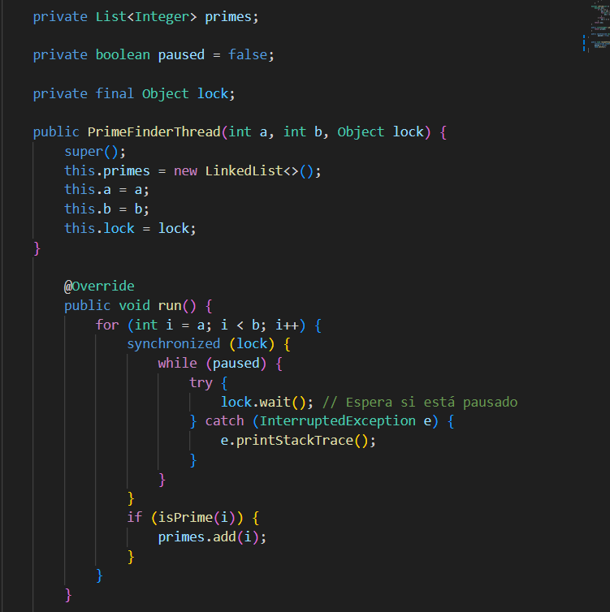
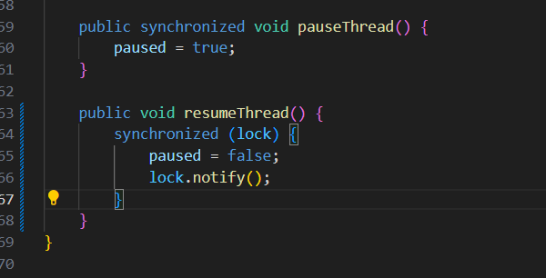
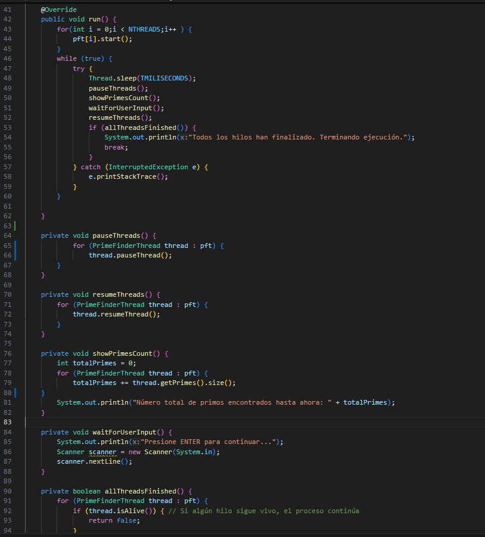
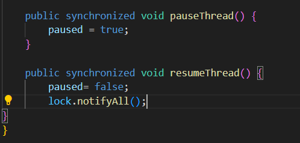
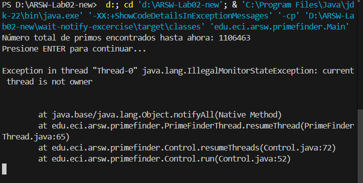
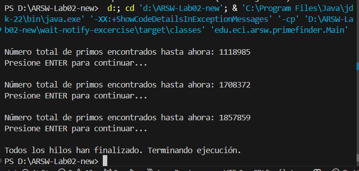
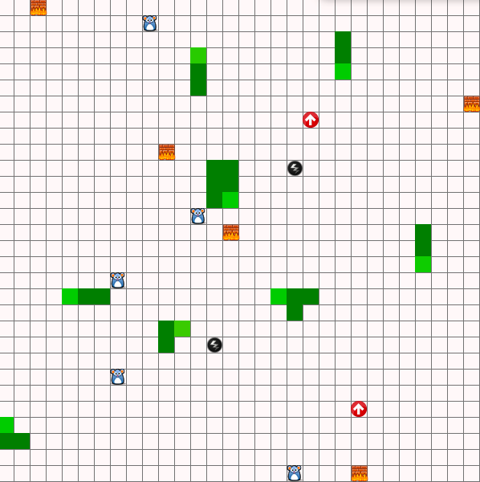
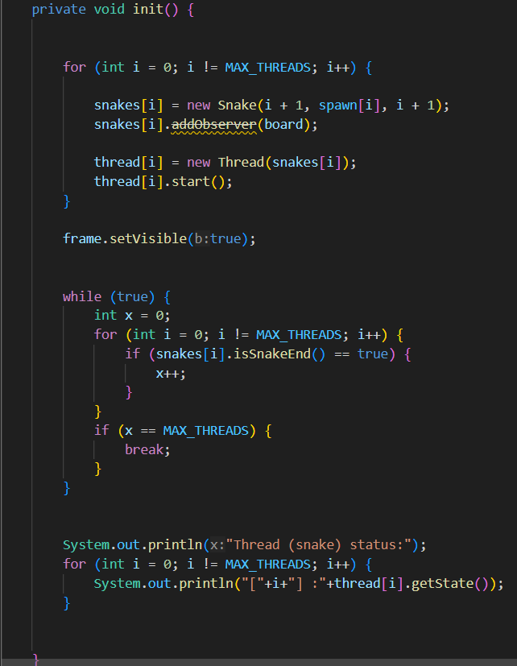

## Escuela Colombiana de Ingeniería
### Arquitecturas de Software

### Laboratorio - Programación concurrente, condiciones de carrera, esquemas de sincronización, colecciones sincronizadas y concurrentes.
## INTEGRANTES:
### Santiago Guerra
### Andrés Rodríguez

## Introducción 

El presente laboratorio tiene como objetivo profundizar en los conceptos de programación concurrente, manejo de condiciones de carrera, esquemas de sincronización y el uso adecuado de colecciones sincronizadas y concurrentes. 
A través de la implementación y modificación de dos ejercicios prácticos, 
se busca que los estudiantes comprendan la importancia de gestionar la concurrencia en aplicaciones multihilo y cómo evitar errores comunes relacionados con el acceso concurrente a recursos compartidos.

## Parte I Control de hilos con wait/notify

Descargue el proyecto PrimeFinder. Este es un programa que calcula números primos entre 0 y M (Control.MAXVALUE), concurrentemente, distribuyendo la búsqueda de los mismos entre n (Control.NTHREADS) hilos independientes.

Se necesita modificar la aplicación de manera que cada t milisegundos de ejecución de los threads,
se detengan todos los hilos y se muestre el número de primos encontrados hasta el momento. Luego,
se debe esperar a que el usuario presione ENTER para reanudar la ejecución de los mismos. Utilice los mecanismos de sincronización provistos por el lenguaje (wait y notify, notifyAll).

Tenga en cuenta:

1. La construcción synchronized se utiliza para obtener acceso exclusivo a un objeto.

2. La instrucción A.wait() ejecutada en un hilo B pone en modo suspendido al hilo B (independientemente de qué objeto 'A' sea usado como 'lock'). Para reanudarlo, otro hilo activo puede reanudar a B haciendo 'notify()' al objeto usado como 'lock' (es decir, A).

3. La instrucción notify(), despierta el primer hilo que hizo wait() sobre el objeto.

4. La instrucción notifyAll(), despierta todos los hilos que estan esperando por el objeto (hicieron wait()sobre el objeto).

## Desarrollo parte I
Se realizo la modificación primero de la clase PrimerFinderThread, a la cual le añadimos un atributo nuevo llamado Lock, el cual es un objeto que nos ayudara a manejar la sincronización, lo que hara que el hilo espere y se reanude utilizando ese objeto.
Tambien se crearon los metodos pausethread y resumethread , para tener control sobre los hilos
NOTA: Se recomienda no hacer bloques de sincronización innecesarios, debido a que pueden traer errores en el resultado

A su vez, en la clase control, se realizo una correcta implementación de estos metodos, en el metodo run, como se muestra en la imagen

ERRORES que encontramos en la implementación:

Al momento de utilizar bloques sincronizados, nos dimos cuenta que la forma en que sincronizamos los metodos, puede afectar a la correcta salida del programa. Por ejemplo:

Si utilizamos una sincronización de esta manera: 

Obtenemos este error al ejecutar.

Por que pasa esto, el problema radica en que, un hilo esta tratando invocar a los metodos notifyall() en un objeto de sincronización del cual no es el propietario, cuando marcamos un metodo como synchronized, asumimos que el hilo que ejecuta el metodo ya tiene el bloqueo de sincronización.

Para solucionar esto, debemos asegurarnos de sincronizar sobre el objeto lock , en vez del monitor de objeto de la clase 

y la salida, sera la que esperamos:

## Parte II

SnakeRace es una versión autónoma, multi-serpiente del famoso juego 'snake', basado en el proyecto de João Andrade -este ejercicio es un 'fork' del mismo-. En este juego:

* N serpientes funcionan de manera autónoma.
* No existe el concepto de colisión entre las mismas. La única forma de que mueran es estrellándose contra un muro.
* Hay ratones distribuídos a lo largo del juego. Como en el juego clásico, cada vez que una serpiente se come a un ratón, ésta crece.
* Existen unos puntos (flechas rojas) que teletransportan a las serpientes.
* Los rayos hacen que la serpiente aumente su velocidad.

Ejercicio

1. Analice el código para entender cómo hace uso de hilos para crear un comportamiento autónomo de las N serpientes.

2. De acuerdo con lo anterior, y con la lógica del juego, identifique y escriba claramente (archivo RESPUESTAS.txt):

* Posibles condiciones de carrera.
* Uso inadecuado de colecciones, considerando su manejo concurrente (para esto, aumente la velocidad del juego y ejecútelo varias veces hasta que se genere un error).
* Uso innecesario de esperas activas.

3. Identifique las regiones críticas asociadas a las condiciones de carrera, y haga algo para eliminarlas. Tenga en cuenta que se debe sincronizar estríctamente LO NECESARIO. En su documento de respuestas indique, la solución realizada para cada ítem del punto 2. Igualmente tenga en cuenta que en los siguientes puntos NO se deben agregar más posibles condiciones de carrera.

4. Como se puede observar, el juego está incompleto. Haga los ajustes necesarios para que a través de botones en la interfaz se pueda Iniciar/Pausar/Reanudar el juego: iniciar el juego no se ha iniciado aún, suspender el juego si está en ejecución, reactivar el juego si está suspendido. Para esto tenga en cuenta:

* Al pausar (suspender) el juego, en alguna parte de la interfaz (agregue los componentes que desee) se debe mostrar:
  - La serpiente viva más larga.
  - La peor serpiente: la que primero murió.

Recuerde que la suspensión de las serpientes NO es instantánea, y que se debe garantizar que se muestre información consistente.

## Desarrollo Parte II

1. En la clase SnakeApp, se inicializan las serpientes y se asignan a hilos individuales, esto sucede en este metodo:

Al implmentar la interfaz runnable, cada nueva serpiente, define su propio metodo run, que contiene la logica de como se mueve y el comportamiento arbitrario de cada serpiente. Al iniciar el hilo , se ejecuta su propio metodo run, en paralelo con los demas hilos de las demas serpientes.

2. Revisar el archivo RESPUEESTAS.TXT

Aqui se aumento la velocidad del juego y se llego a un error:

El error indica que múltiples hilos intentan modificar o acceder a una estructura de datos compartida como lo es la LinkedList asociada al cuerpo de las serpientes al mismo tiempo sin una sincronización adecuada, lo que puede provocar un comportamiento inesperado
Para arreglar esto podemos usar unos bloques de sincronización en los metodos checkIfBarrier y tambien el metodo drawsnake de la clase Board, y asi se solucionara el error, incluso si aumentamos aun mas la velocidad del juego.

